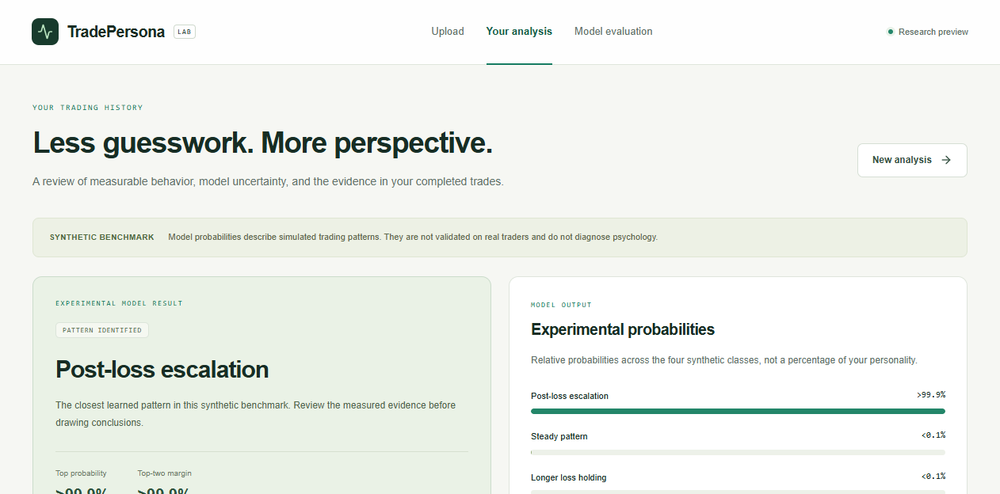
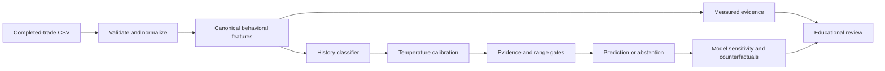
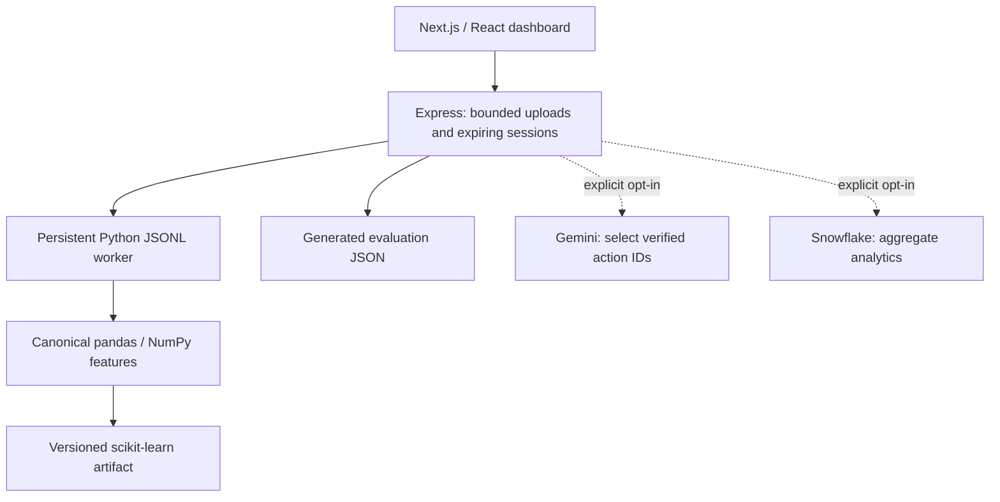

# TradePersona

Behavioral trading analytics with a reproducible ML benchmark, calibrated experimental probabilities, and evidence you can inspect.

**Research preview: all reported model results are synthetic benchmark results. No real-world trader classification accuracy has been established.**



## What it does

Upload a history of completed trades to inspect activity, position sizing, responses after realized losses, holding behavior, and consistency. The dashboard separates measured facts from experimental classification, withholds unsupported classifications, and shows quantitative explanations and hypothetical model counterfactuals. A separate [evaluation page](http://localhost:3000/evaluation) loads generated experiment artifacts, rather than frontend constants.

The project preserves its Next.js/Express/Python architecture and optional Snowflake/SEC utilities. The original on-request, per-trade Random Forest has been replaced with explicit training and a cached history-level inference artifact. Gemini is optional educational-action curation; it never establishes quantitative facts.

## ML pipeline



There are **20 versioned features**, shared between training and inference: activity and completion intervals, daily activity variability, relative position sizing, size and pace after wins/losses, consecutive-loss response, outcome ratios, and explicit holding durations. See the [feature definitions](docs/FEATURES.md).

Class names describe assigned simulator regimes:

| Dashboard name | Compatibility key | Simulated tendency |
|---|---|---|
| Steady pattern | `calm_trader` | Baseline regime with randomized nuisance variation |
| Longer loss holding | `loss_aversion` | Longer losing-position holding durations |
| High activity | `overtrader` | More frequent completed trades |
| Post-loss escalation | `revenge_trader` | Larger positions and shorter delays after losses |

These are **not diagnoses**, verified human labels, or evidence that any strategy is financially appropriate.

## Why the original datasets were excluded

The four original CSVs have 40,000 rows but only **four identifiable source trajectories, one per class**. Labels come from filenames; three sources share an exact one-minute timestamp grid, while the fourth uses ten-second intervals. Holding and outcome timing are ambiguous, and missingness and corruptions differ by source. Neither a random trade split nor a chronological split would validate classification of unseen traders. See the [forensic audit](docs/DATA_AUDIT.md).

The replacement benchmark generates **2,000 independent trajectories / 224,524 completed trades**, with overlapping latent behavior parameters and shared nuisance distributions. One full trajectory is one observation. Whole groups are assigned to train (640), model selection (240), calibration (240), policy validation (240), test (320), and shift stress test (320), using separate seeds. No original CSV rows enter this benchmark. The test is materialized after the model/calibration/policy decisions are saved. See [methodology and leakage controls](docs/METHODOLOGY.md).

## Measured evaluation

Headline: **held-out synthetic macro F1 0.779, conditional 95% bootstrap CI [0.735, 0.820]**, from 320 independent test histories. Macro F1 weights the four regimes equally. Accuracy and balanced accuracy are both 0.778. Class-level results and the confusion matrix are in the [technical report](docs/REPORT.md) and [machine-readable artifact](backend/ml/artifacts/v1/evaluation.json).

The following is the **selection-validation comparison**, not five final-test results:

| Model | Validation macro F1 |
|---|---:|
| Original deterministic Python heuristic | 0.284 |
| Training-majority baseline | 0.100 |
| Logistic regression — selected | **0.824** |
| Random Forest | 0.822 |
| Histogram gradient boosting | 0.814 |

Logistic regression won the predefined selection rule. The small validation differences do not establish statistically significant superiority. Complex models did not justify replacing it on this benchmark.

Temperature scaling was fitted on the calibration partition and selected on a separate policy-validation partition. On the final test, Brier score changed **0.2974 → 0.2967**, log loss **0.5171 → 0.5154**, and ECE **0.0446 → 0.0454**. Calibration did not improve every measure; ECE became slightly worse.

At the fixed 0.55 probability / 0.10 margin policy, **coverage is 85.0%**, retained-history accuracy **81.6%**, and retained-history macro F1 **0.808**. Range and data-sufficiency gates also apply. The shifted synthetic regime drops to **0.704 macro F1**. These limitations are part of the result.

Robustness on 80 held-out histories: label agreement was 100% under ±30-second timestamp jitter, 100% under 2% position-size noise, 95% after removing 10% of trades, and 86.25% on the first half of a history. Exact duplicates are removed; missing holding duration causes abstention in every case. Agreement is stability, not correctness.

## Explainability and uncertainty

- Local explanations compute the actual selected-class probability change when a feature is replaced with its training median. They are sensitivity probes, not additive SHAP values or causal effects; correlated features can make individual probes unrealistic.
- Global importance is permutation macro-F1 decrease on selection validation.
- Counterfactuals edit raw sizing or holding history, recompute all dependent features, and rerun the model. Out-of-range scenarios are omitted. They do not predict returns or recommend trades.
- Abstention covers insufficient trades/outcomes, missing features, overlapping or tied completion times, unsupported feature ranges, low probability, and close leading classes.
- Weekly summaries are descriptive; windows from one trader are not additional independent test observations.
- Style alignment uses explicitly manual equal-behavior references. Quarterly 13F holdings and famous investors are not treated as psychological ground truth.

## Quickstart

Use Node.js 22+ and Python 3.11–3.14 (3.12 recommended). Python dependencies are pinned; the saved artifact was generated with scikit-learn 1.8.0. No API keys or database are needed.

```sh
git clone https://github.com/youssef061204/TradePersona.git
cd TradePersona
python -m venv .venv
```

Activate on macOS/Linux with `source .venv/bin/activate`, or PowerShell with `.\.venv\Scripts\Activate.ps1`. Alternatively set `PYTHON_PATH` to a compatible Python executable.

```sh
python -m pip install -r backend/requirements.txt
npm ci
npm --prefix backend ci
npm --prefix frontend ci
npm run ml:evaluate
npm run dev
```

Open **http://localhost:3000**; API: **http://localhost:3001**. Download the synthetic sample on the upload page. It is generated with simulator seed 88001, outside all benchmark partitions.

### CSV contract

```csv
timestamp,quantity,entry_price,profit_loss,holding_minutes,asset
2025-01-02T10:30:00Z,10,100,-12,20,AAA
2025-01-02T12:00:00Z,12,101,18,35,AAA
```

One account and currency, one row per **completed position**, positive quantity/entry price, finite realized P/L. Timestamp means completion time; ISO timestamps without timezone are interpreted as UTC. `holding_minutes` is optional for factual metrics but required for classification. At least 30 trades, five wins and five losses are required. Raw execution lots, ambiguous simultaneous outcomes, overlapping positions, and negative-quantity short encodings are unsupported. The application cannot independently verify a user's timestamp semantics.

Files are limited to 5 MiB / 50,000 rows. Malformed rows reject the upload with quality details. Exact repeated behavioral records are removed with a warning. See the [API/input contract](docs/CONTRACT.md).

## Reproduce the experiment

The committed artifact allows inference without training. Recalculate its scores and check that frozen predictions match the model:

```sh
npm run ml:evaluate
```

Reproduce training into a **new** directory; paths are relative to `backend`:

```sh
npm run ml:train -- --output ml/artifacts/reproduction-1
npm run ml:evaluate -- --output ml/artifacts/reproduction-1
```

`npm run ml:train` targets `ml/artifacts/v1` and refuses to overwrite an existing experiment. For a deliberate new benchmark, choose a new directory/version. Do not tune against published test results. A separate-directory reproduction matched all dataset fingerprints, comparison metrics, predictions, calibration, coverage, importance, robustness and shift results exactly in the tested environment. Metadata records seeds, hyperparameters, package versions, Git commit, source hashes, model checksum, feature schema, split manifest, and saved predictions. Cross-platform floating-point differences remain possible.

## Tests and CI

```sh
npm test                       # Python and Node tests
npm run lint
npm run build
npm --prefix frontend exec -- playwright install chromium
npm run test:e2e                # Starts the production frontend + real API
```

The suite includes hand-calculable features, input limits, full split-manifest isolation, calibration/probability contracts, abstention, faithful sensitivity/counterfactual checks, session isolation/expiry, bounded worker recovery, constrained coaching, and browser uploads through actual Python inference. GitHub Actions runs these checks and dependency audits. Its training smoke test uses small, separately seeded fixtures; it does not retrain the full benchmark on every push.

## Architecture and deployment



Python is the only source of behavioral formulas. There is one worker with bounded queue/timeouts and cached artifact loading. CSVs are processed in memory, not written to disk. At most 100 result sessions live for 30 minutes; restart clears them. Session UUIDs are bearer capabilities, not account authentication. The UI keeps only the capability in tab-scoped session storage. Optional external services are disabled by default.

The backend has an unprivileged Docker image and a Render Blueprint. See [deployment, CORS, privacy, and opt-in integrations](DEPLOY_RENDER.md). Hosted deployment, live Snowflake/Gemini credentials, account authentication and durable multi-user storage are separate operational concerns; no cloud service was published as part of this local change.

## Limitations

Synthetic labels encode generator tendencies. They do not identify real psychological traits; high confidence can be wrong outside the simulation. The four classes are mutually exclusive and balanced for this experiment, whereas real behavior can be mixed and change over time. Bootstrap intervals condition on this generator/class mixture. Simple marginal range checks cannot detect every joint distribution shift. Holdings and P/L are not a complete measure of portfolio risk, equity, liquidity, market opportunity, or trading skill. Counterfactuals are model sensitivities and offer no guarantee of investment performance.

The next defensible research step is independently collected, consented completed-trade histories with trader IDs, outcome-availability timestamps, a documented annotation rubric, and held-out real traders. Until then, the project demonstrates **ML engineering and evaluation discipline**, not a validated financial product.

**Stack:** Python, pandas, NumPy, SciPy, scikit-learn, Node.js/Express, TypeScript, Next.js/React, Recharts, Playwright, Docker, GitHub Actions; optional Snowflake and Gemini.
