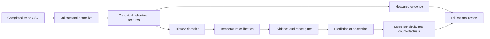
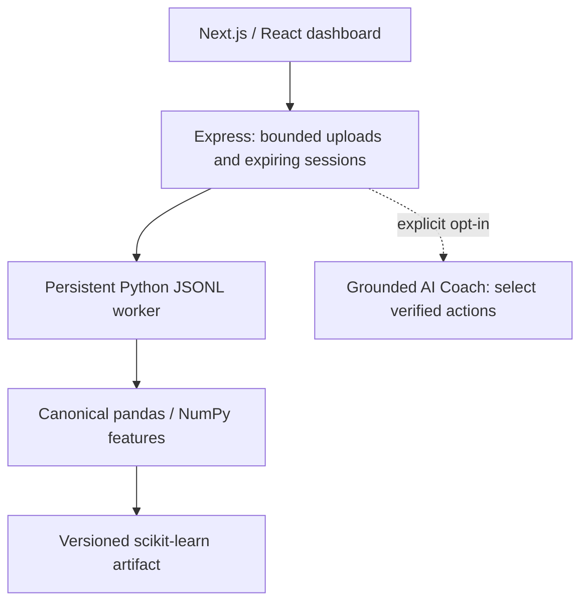

# TradePersona

Behavioral trading analytics with a reproducible ML benchmark, calibrated experimental probabilities, and evidence you can inspect.

**Research preview: all reported model results are synthetic benchmark results. No real-world trader classification accuracy has been established.**


## What it does

Upload a history of completed trades to inspect activity, position sizing, responses after realized losses, holding behavior, and consistency. The dashboard separates measured facts from experimental classification, withholds unsupported classifications, and shows quantitative explanations and hypothetical model counterfactuals. A separate evaluation page loads generated experiment artifacts, rather than frontend constants.

The project preserves its Next.js/Express/Python architecture and optional Snowflake/SEC utilities. In v2, descriptive nuisance measurements remain visible but the classifier is restricted to concept-linked activity and outcome-conditional features to reduce simulator shortcut learning. Gemini is an explicit opt-in AI Coach that can only curate verified, deterministic coaching statements; it never establishes quantitative facts or overrides model abstention.

## ML pipeline



There are **20 versioned features**, shared between training and inference: activity and completion intervals, daily activity variability, relative position sizing, size and pace after wins/losses, consecutive-loss response, outcome ratios, and explicit holding durations. Class names describe assigned simulator regimes: `calm_trader`, `loss_aversion`, `overtrader`, and `revenge_trader`. These are **not diagnoses**, verified human labels, or evidence that any strategy is financially appropriate.

## Benchmark v2

The v2 benchmark uses **2,720 independent internal trajectories** across train (960), model selection (320), calibration (320), policy validation (320), final test (400), and shifted stress test (400). Nuisance variables such as baseline size, ordinary size noise, baseline holding duration, and win rate use the same distributions across classes; class identity is introduced through the intended behavioral mechanism. Whole trajectories, never individual trades, are the unit of splitting.

| Benchmark | Result |
| --- | ---: |
| Internal held-out synthetic macro F1 | **0.775** |
| Independent-generator synthetic macro F1 | **0.805** |
| Shifted synthetic macro F1 | **0.687** |
| Independent pure-history coverage after abstention | **64.6%** |
| Accuracy among retained independent pure histories | **85.8%** |
| Mixed/ambiguous-history abstention rate | **52.4%** |

The independent benchmark is generated by a separate implementation that is never used for model fitting, model selection, calibration, or threshold selection. It exists specifically to expose simulator-specific shortcut learning. These are still synthetic results; they do **not** establish accuracy on real traders.

Classification deliberately excludes shortcut-prone descriptive features including absolute `median_holding_minutes`, `holding_cv`, and `size_cv`. Those measurements remain available in the report for descriptive analysis. Current model selection favors multinomial logistic regression (`C=0.1`) on the dedicated selection partition.

## Explainability and uncertainty

- Local explanations compute selected-class probability change when a model feature is replaced with its training median. They are sensitivity probes, not causal effects.
- Counterfactuals edit raw history, recompute dependent features, and rerun the model. They do not predict returns or recommend trades.
- Abstention covers insufficient evidence, unsupported feature ranges, mixed strong signals, low probability, and close leading classes.
- Weekly summaries are descriptive; windows from one trader are not additional independent test observations.

## Quickstart

Use Node.js 22+ and Python 3.11–3.14. Python dependencies are pinned; the saved artifact was generated with scikit-learn 1.8.0.

```sh
git clone https://github.com/youssef061204/TradePersona.git
cd TradePersona
python -m venv .venv
python -m pip install -r backend/requirements.txt
npm ci
npm --prefix backend ci
npm --prefix frontend ci
npm run ml:evaluate
npm run dev
```

### CSV contract

Required columns: `timestamp`, `quantity`, `entry_price`, `profit_loss`. `holding_minutes` is optional for factual metrics but required for classification. One account and currency per upload. At least 30 trades, five wins, and five losses are required for classification. Files are limited to **50 MiB / 500,000 rows**.

## Reproduce the experiment

```sh
npm run ml:evaluate
npm run ml:external-evaluate
npm run ml:train -- --output ml/artifacts/reproduction-1
npm run ml:evaluate -- --output ml/artifacts/reproduction-1
```

The committed artifact allows inference without retraining. Full training writes reproducibility artifacts into the chosen output directory. Do not tune against published test or external benchmark results.

## Tests and CI

```sh
npm test
npm run lint
npm run build
npm run test:e2e
```

The suite includes feature calculations, input limits, abstention, sensitivity/counterfactual checks, external-generalization regressions, constrained coaching, worker recovery, and browser/API flows.

## Architecture



Python remains the source of behavioral formulas. CSVs are processed in memory. The optional AI Coach is downstream of deterministic analysis: it cannot create probabilities, change labels, override abstention, invent numbers, or provide personalized investment recommendations.

## Limitations

Synthetic labels encode generator tendencies. They do not identify real psychological traits. Real behavior can be mixed and change over time. The external benchmark is independently implemented but remains synthetic. Calibration may not transfer to real users, and mixed histories are not always rejected. Counterfactuals are model sensitivities, not causal claims or financial forecasts.

The next defensible research step is independently collected, consented completed-trade histories with trader IDs, outcome-availability timestamps, a documented annotation rubric, and held-out real traders. Until then, the project demonstrates **ML engineering and evaluation discipline**, not a validated financial product.

**Stack:** Python, pandas, NumPy, SciPy, scikit-learn, Node.js/Express, TypeScript, Next.js/React, Recharts, Playwright, Docker, GitHub Actions; optional Snowflake and Gemini.
